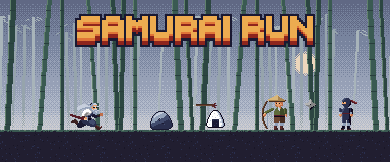

# SAMURAI RUN



*An endless 2D pixel-art runner: parry arrows and shuriken with your katana and see how far the samurai can run.*

대나무 숲을 끝없이 달리는 사무라이의 **2D 픽셀 아트 오토 러너 액션 게임**입니다 (Unity 6).
사무라이는 저절로 앞으로 달리고, 플레이어는 **점프**와 **베기** 두 버튼만으로 장애물과 구덩이, 적의 공격을 헤쳐 나가야 합니다.
날아오는 화살과 수리검을 칼로 되받아쳐 적을 쓰러뜨리며 얼마나 멀리 달릴 수 있는지 겨뤄 보세요.

## 조작법

| 키 | 동작 |
|---|---|
| `Z` | 점프 — 길게 누르면 높이, 짧게 누르면 낮게 뜁니다 |
| `X` | 베기 — 날아오는 화살·수리검·통나무를 칼로 쳐냅니다 (패링) |
| `R` | 쓰러진 뒤 다시 달리기 |
| `Enter` `Space` `Z` `X` 또는 START 클릭 | 시작 화면에서 게임 시작 |

## 게임 방법

- **체력** — 주먹밥 3개로 시작합니다. 장애물, 적의 몸, 화살·수리검, 통나무에 닿으면 하나씩 줄고, 맞은 뒤 1.2초 동안은 깜빡이며 무적입니다.
- **구덩이** — 땅이 끊긴 곳에 떨어지면 체력과 상관없이 바로 끝납니다. 구덩이 근처에는 장애물이나 적이 나오지 않습니다.
- **패링** — `X`를 누르면 칼을 휘두르고, 칼에 맞은 투사체는 튕겨 나갑니다.
  - **저스트 패링**: 휘두르기 시작한 뒤 0.15초 안에 맞히면 투사체가 금빛으로 바뀌어 쏜 적에게 되돌아가 그 적을 쓰러뜨립니다. 화면이 잠깐 멈추며(히트스톱) 스파크가 터집니다.
  - **일반 패링**: 그보다 늦게 맞히면 투사체가 위로 튕겨 나가 사라집니다. 적은 그대로 남습니다.
- **적 처치와 회복** — 궁수와 닌자는 저스트 패링으로 되돌려 보낸 자기 투사체에 맞아야 쓰러집니다. 쓰러진 적은 주먹밥을 떨어뜨리고, 주우면 체력이 1 회복됩니다 (체력이 가득하면 주먹밥은 그대로 남습니다).
- **콤보** — 저스트 패링에 성공할 때마다 1씩 오르고, 피해를 입으면 0으로 돌아갑니다.
- **속도** — 50m를 달릴 때마다 조금씩 빨라집니다. 처음 속도 5에서 400m쯤 최고 속도 9에 이릅니다.
- **게임 오버** — 쓰러지면 달린 거리(Distance)와 최대 콤보(Max Combo)가 나옵니다. `R`을 누르면 다시 달립니다.

## 등장하는 것들

| 이름 | 나오기 시작 (달린 시간) | 설명 |
|---|---|---|
| 바위 | 2초 | 땅에 놓인 장애물. 칼로는 막을 수 없어 점프로 넘어야 합니다 |
| 통나무 | 6초 | 땅에 놓인 장애물 |
| 죽창 | 10초 | 땅에 박힌 대나무 창 |
| 궁수 | 12초 | 멈춰 서서 1.7초마다 화살을 쏩니다 |
| 흔들리는 통나무 | 20초 | 위에서 진자처럼 휘둘러 내려와 몸 높이로 지나갑니다. 칼로 치면 반대쪽으로 튕겨 나갑니다 |
| 수리검 닌자 | 30초 | 2.1초마다 수리검을 던집니다 |
| 주먹밥 | 적을 쓰러뜨렸을 때 | 체력 1 회복 |

## 화면과 소리

- **시작 화면** — SAMURAI RUN 로고와 START 버튼 뒤로 사무라이가 달립니다.
- **게임 화면** — 주먹밥 체력, 달린 거리, 콤보가 표시됩니다. 체력을 잃으면 주먹밥이 단계적으로 비고, 회복하면 다시 차오릅니다.
- **효과음** — 칼 휘두르기, 패링 금속음, 점프·착지·발소리, 활·수리검, 통나무, 회복, 게임오버 징 등 19가지. 녹음 없이 코드로 합성했습니다.
- **배경음악** — 일본 전통 음계(미야코부시)로 만든 시대극풍 곡입니다. 샤쿠하치(대나무 피리)·고토·샤미센·타이코 소리를 합성했고, 136 BPM으로 약 70초 동안 이어지다 끊김 없이 반복됩니다. 쓰러지면 작아지고 다시 달리면 원래대로 돌아옵니다.
- 볼륨은 `Assets/Resources/SoundSettings.asset`에서 전체·음악·효과음별로 조절합니다.

## 실행 방법

1. **Unity 6000.5.4f1**을 설치합니다 (URP 2D, 새 Input System 사용).
2. Unity Hub에서 **Add → Add project from disk**로 이 폴더를 엽니다.
3. Play를 누르면 시작 화면부터 시작합니다 (`Tools > Samurai Runner > Play는 시작 화면부터`, 기본으로 켜져 있음).

빌드 설정에는 `Assets/Scenes/TitleScene.unity`(시작 화면) → `Assets/Scenes/SampleScene.unity`(게임) 순서로 들어 있습니다.
조작키는 SampleScene의 Player 오브젝트에 있는 `PlayerInputReader`에서 바꿀 수 있습니다.

## 프로젝트 구조

```
Assets/
├─ Scenes/          TitleScene (시작 화면), SampleScene (게임)
├─ Scripts/
│  ├─ Player/         달리기·점프, 베기·패링, 체력, 입력, 애니메이션
│  ├─ Enemies/        궁수·닌자 (투사체를 던지는 적)
│  ├─ Combat/         화살·수리검, 흔들리는 통나무, 닿으면 피해
│  ├─ Spawning/       장애물·적 등장
│  ├─ Environment/    구덩이가 있는 땅 생성, 배경 패럴랙스
│  ├─ Items/          주먹밥 회복 아이템과 드롭
│  ├─ Systems/        게임 흐름, 거리, 콤보, 속도 증가, 히트스톱, 패링 연출
│  ├─ UI/             HUD, 시작 화면
│  ├─ Audio/          효과음·배경음악 재생, 소리 설정
│  ├─ CameraControl/  카메라 따라가기
│  ├─ Common/         스프라이트 애니메이션 등 공통 기능
│  ├─ Effects/        칼빛·스파크처럼 번쩍이고 사라지는 이펙트
│  └─ Editor/         단계별 자동 구성 메뉴
├─ Art/             적·무기·장애물·배경·UI 픽셀 아트
├─ Prefabs/         적, 투사체, 장애물, 함정, 아이템
├─ Resources/       효과음, 배경음악, SoundSettings
└─ Assets/FREE_Samurai 2D Pixel Art v1.2/   사무라이 스프라이트 팩
Tools/              그림·소리 생성기
Docs/               README 이미지
```

## 에디터 메뉴 (Tools > Samurai Runner)

씬과 에셋을 자동으로 구성하는 메뉴입니다. 각 단계는 앞 단계를 먼저 적용하므로, 전체를 다시 맞추려면 **12단계**만 실행하면 됩니다.
앞 단계만 따로 다시 실행하면 뒤 단계에서 바꾼 내용이 되돌아갈 수 있습니다.

| 메뉴 | 하는 일 |
|---|---|
| 씬 자동 구성 | 픽셀 아트 임포트 설정, 플레이어·바닥·카메라 배치 |
| 2단계 - 전투 요소 추가 | 레이어, 적·투사체·장애물 프리팹, 체력, 게임 시스템, 스포너, HUD |
| 3단계 - 픽셀 장애물 적용 | 바위·통나무·죽창 그림과 충돌 범위 |
| 4단계 - 적·무기·배경 적용 | 적·무기 그림, 패럴랙스 배경, 바닥 타일 |
| 5단계 - 궁수·닌자 애니메이션 적용 | 대기·공격·쓰러짐 애니메이션 |
| 6단계 - 처치 시 주먹밥 드롭 | 주먹밥 회복 아이템 |
| 7단계 - 구덩이(낙사) 추가 | 구덩이가 있는 땅 생성 |
| 8단계 - 흔들리는 통나무 함정 추가 | 통나무 함정 |
| 9단계 - 속도 증가·게임오버 기록 | 50m마다 속도 증가, 게임오버 기록 |
| 10단계 - 시작 화면 만들기 | 시작 화면 씬과 빌드 설정 |
| 11단계 - 효과음 적용 | 효과음 가져오기와 SoundSettings |
| 12단계 - 배경음악 적용 | 배경음악 가져오기 |

`테스트` 메뉴에서는 Play 중에 화면의 적을 모두 쓰러뜨리거나 체력을 1 줄여 볼 수 있습니다.

## 그림·소리 다시 만들기 (Tools/)

| 파일 | 만드는 것 | 명령 |
|---|---|---|
| `gen_enemy_sprites.ps1` | 궁수·닌자 시트, 화살·수리검 | `powershell -File Tools\gen_enemy_sprites.ps1 write` |
| `gen_title_sprites.ps1` | 로고, START 글자, 버튼 | `powershell -File Tools\gen_title_sprites.ps1 write` |
| `gen_readme_banner.ps1` | 이 README의 배너 (게임 스프라이트를 모아 꾸민 그림) | `powershell -File Tools\gen_readme_banner.ps1 write` |
| `SfxGen/` | 효과음 19종 | `dotnet run -c Release --project Tools/SfxGen -- Assets/Resources/Sfx` |
| `BgmGen/` | 배경음악 | `dotnet run -c Release --project Tools/BgmGen -- Assets/Resources/Music/bgm_samurai.wav` |

PowerShell 스크립트는 Windows PowerShell(System.Drawing)로 동작하며, `write` 대신 `preview`를 주면 미리보기만 만듭니다.
SfxGen·BgmGen은 .NET 10 SDK가 필요합니다.

## 크레딧

- 사무라이 캐릭터: **FREE_Samurai 2D Pixel Art v1.2** 무료 에셋 팩 — 라이선스는 `Assets/Assets/FREE_Samurai 2D Pixel Art v1.2/License.txt`
- 궁수·닌자·화살·수리검과 로고는 이 팩의 색과 그림체에 맞춰 `Tools/` 스크립트로 그렸습니다.
- 효과음과 배경음악은 녹음이나 외부 음원 없이 `Tools/SfxGen`, `Tools/BgmGen`으로 합성했습니다.
